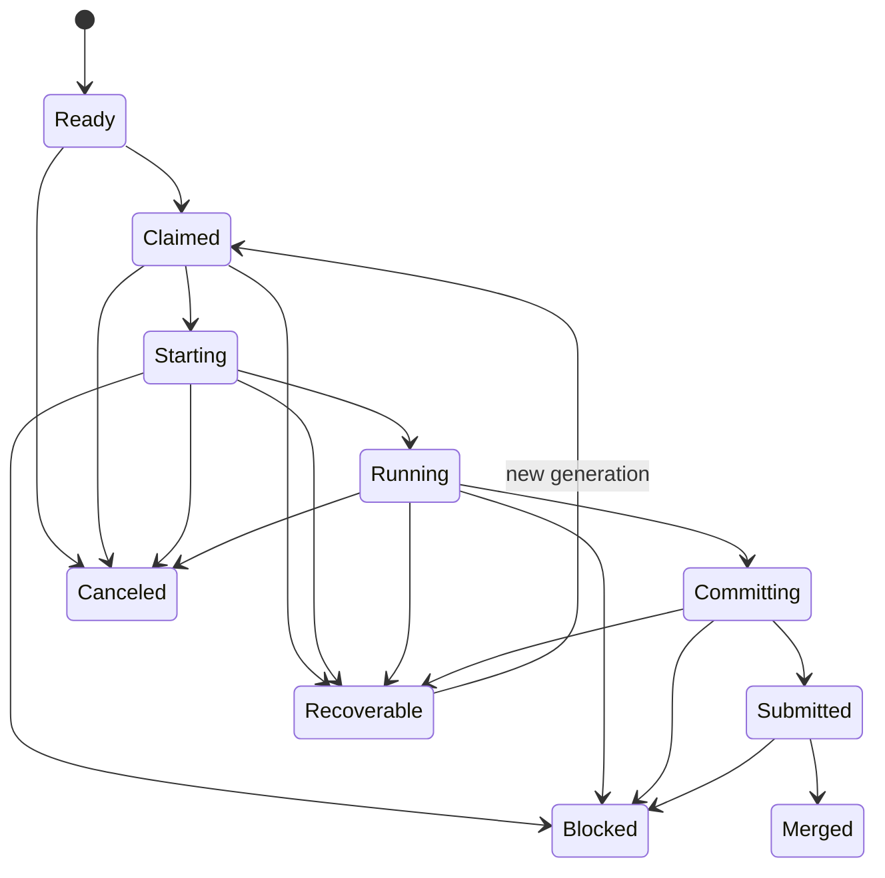

# Durable execution records

> Preview on `feature/execution-control-layer`. The CLI is additive and no Gas Town daemon calls it automatically.

Gas Town execution records give controllers and agent wrappers an explicit, durable account of one
work item's execution. They solve three mechanical problems:

- a retry must not create a second attempt or repeat a transition;
- an old worker must not update work after a replacement takes ownership; and
- a crash must not erase the difference between claimed, running, submitted, and merged work.

The package records facts. It does not decide which work is ready, when a lease is expired, whether
a worker should be replaced, or whether a change may merge. Those remain caller policy.

## Lifecycle



`Merged`, `Blocked`, and `Canceled` are terminal. Claiming a `Recoverable` record archives the old
attempt and creates a new generation. Execution IDs may not be reused within a work item.

Every attempt scoped write supplies both its execution ID and generation. A stale process receives
an `execution fence mismatch` and cannot heartbeat or transition the replacement attempt. A
transition also supplies its expected source state, which prevents a delayed but otherwise valid
command from applying after the record has advanced.

## Storage and recovery

Records live below `<town>/.runtime/executions/`:

```text
executions/
├── journals/<sha256(work-id)>.jsonl
├── records/<sha256(work-id)>.json
└── store.lock
```

The append only journal is authoritative. Each event contains the complete resulting record and a
SHA-256 link to the previous event. The store syncs the event before atomically replacing the JSON
snapshot. If the process dies between those operations, the next read replays the journal and
repairs the snapshot. `gt execution list` also reads journals, so such a record cannot disappear
from listings.

A town wide file lock serializes journal and snapshot changes across `gt` processes. The path uses a
hash of the work ID, so external identifiers cannot escape the storage directory.

## CLI contract

All mutations require an idempotency key chosen by the caller. Retrying the same semantic command
with the same key returns the existing result. Reusing a key for different content fails.

```bash
# Register work before assignment.
gt execution create ccm-123 \
  --rig cloudcontentmanager \
  --repository cloudcontentmanager \
  --role implementation \
  --idempotency-key ccm-123:create

# Claim generation 1. Omit --generation to accept the next generation.
gt execution claim ccm-123 \
  --execution-id 018f-example \
  --agent cloudcontentmanager/polecats/toast \
  --runtime codex \
  --lease-until 2026-09-20T18:00:00Z \
  --idempotency-key ccm-123:claim:1

# Compare and swap from claimed to starting.
gt execution transition ccm-123 claimed starting \
  --execution-id 018f-example \
  --generation 1 \
  --idempotency-key ccm-123:starting:1

# Record liveness without changing lifecycle state.
gt execution heartbeat ccm-123 \
  --execution-id 018f-example \
  --generation 1 \
  --lease-until 2026-09-20T18:05:00Z \
  --idempotency-key ccm-123:heartbeat:42

# Inspect and verify.
gt execution show ccm-123 --json
gt execution events ccm-123 --json
gt execution verify ccm-123
gt execution list --json
gt execution leases --as-of 2026-09-20T18:10:00Z --json
```

Evidence flags use `kind=value` and may be repeated. Examples include `commit=<sha>`,
`merge_request=<id>`, and `test_run=<uri>`. Gas Town preserves these opaque references without
assigning policy meaning to them.

`gt execution leases` performs explicit clock arithmetic over stored lease timestamps. It reports
`active`, `expired`, `missing`, or `not_applicable` and never changes an execution record. An
external controller must apply its own grace, pause, health, and recovery policy before taking any
action.

### Structural gate records

Required gates are bound to an exact commit and a decision generation. A changed commit resets the
gate to `pending` and increments the generation, so an earlier review cannot approve new content.

```bash
gt execution gate require ccm-123 compliance \
  --commit abc123 --actor policy \
  --idempotency-key ccm-123:gate:compliance:abc123

gt execution gate decide ccm-123 compliance passed \
  --commit abc123 --decision-generation 1 \
  --decided-by cloudcontentmanager/crew/compliance \
  --evidence review=lw://review/42 \
  --idempotency-key ccm-123:gate:compliance:abc123:pass

gt execution gate status ccm-123 --commit abc123 \
  --required compliance,quality --json
```

Gate status is `pending`, `passed`, `blocked`, or `superseded`. The evaluator is read only. Names
supplied through `--required` are policy requirements: a missing record is reported as pending, so
an empty gate set cannot become an implicit approval.

Refinery enforcement is implemented but disabled by default. Arming it requires all three values:

```bash
GT_EXECUTION_GATES_ENABLED=true
GT_EXECUTION_GATE_CANARY_RIG=cloudcontentmanager
GT_EXECUTION_REQUIRED_GATES=compliance,quality
```

Only merge requests whose recorded rig exactly matches the canary are checked. Both the sequential
and batch merge paths verify the submitted branch head first, then require every named gate to be
passed for that exact commit before modifying the target branch. Missing execution records,
missing gate records, stale commit verdicts, blocked verdicts, and incomplete policy configuration
all fail closed. Keep enforcement unset until KingForge shadow verdicts agree with current quality
and compliance decisions.

## Integration sequence

1. Run the KingForge observer with every control capability false.
2. Let a shadow adapter create and advance records from already completed Gas Town actions.
3. Compare records with Beads, sessions, commits, and merge requests.
4. Add the Codex completion handshake behind its own disabled flag.
5. Add advisory lease evaluation. Evaluation reports facts and takes no recovery action.
6. Compare structural gate records with existing review decisions in shadow mode.
7. Enable commit-bound refinery enforcement only for the selected canary rig.
8. Enable fenced recovery only after the canary evidence meets the KingForge rollout criteria.

Older Gas Town binaries ignore `.runtime/executions`. Rollback stops writers and restores the pinned
binary; the journal remains available for investigation and later replay.

## Optional `gt done` handshake

`GT_EXECUTION_HANDSHAKE_ENABLED=true` makes a completed `gt done` participate in the active fenced
record. The command validates that the caller owns the current attempt, records `Running →
Committing` before push or merge queue work, then records `Committing → Submitted` with commit and
merge request evidence before it clears the hook or retires the polecat session.

The handshake is resumable. A repeated `gt done` accepts `Committing` after an interrupted push and
accepts `Submitted` after a completed durable handoff. A failed push or merge request leaves the
record at `Committing` and preserves the session under the existing `gt done` recovery behavior. A
replacement generation or different owner is rejected before mutation.

The environment variable is unset by default. Runtime integrations should expose their own rollout
flag and set this variable only for a selected canary seat after shadow records prove accurate.
